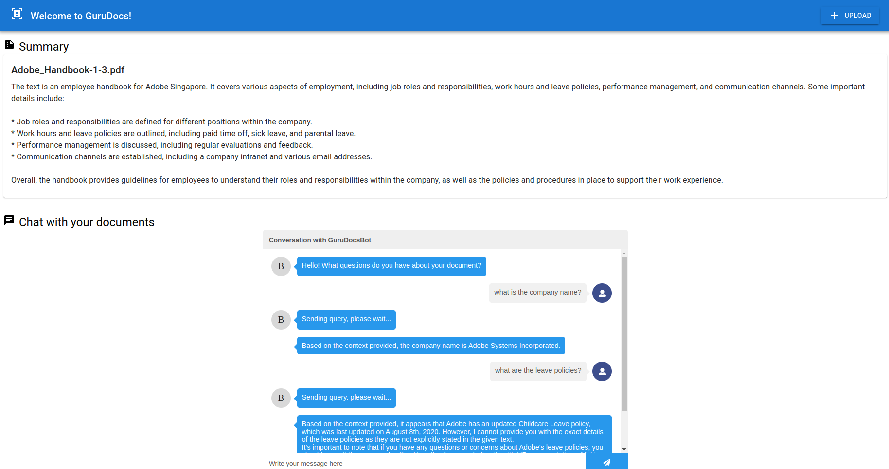
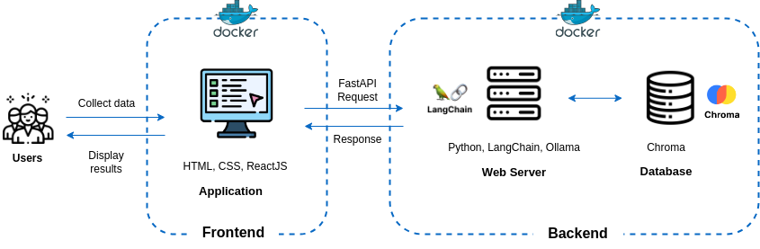
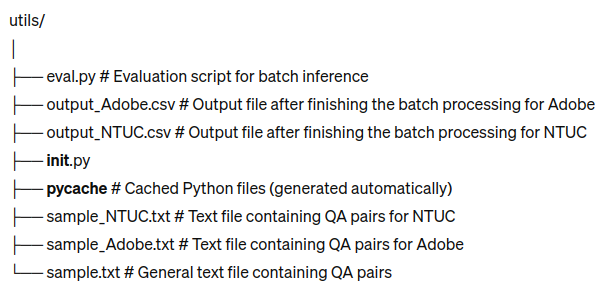
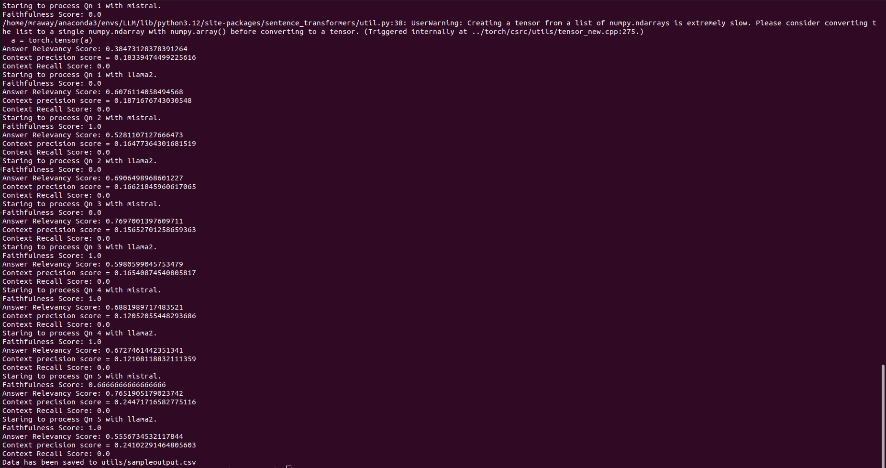
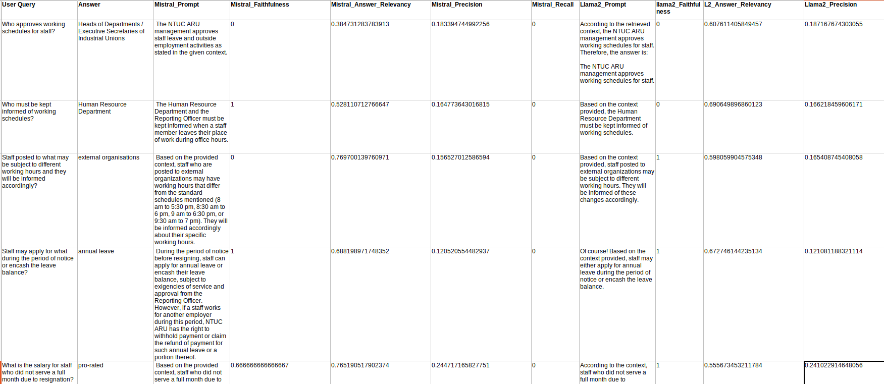

## SECTION 1 : PROJECT TITLE
## GURUDOCS: CHATBOT FOR QUERYING DOCUMENTS USING RAG and LLM




---


## SECTION 2 : EXECUTIVE SUMMARY 

GuruDocs is a free chatbot designed to enhance the efficiency of information retrieval from lengthy policy and/or regulatory documents.  Leveraging Retrieval-Augmented Generation (RAG) and Large Language Models (LLMs), GuruDocs offers context-aware search results, thus improving user experience and productivity. This project addresses the limitations of keyword-based search systems and the challenges in fine-tuning LLMs for specific document queries. 

---

## SECTION 3 : CREDITS / PROJECT CONTRIBUTION

| Official Full Name  | Student ID (MTech Applicable)  | Work Items (Who Did What) |
| :------------ |:---------------:| :-----| 
| Alvin Wong Ann Ying | A0266486M | <ul><li>Created modified version of RAGAs evaluation library that does not require OpenAI API key</li><li>Implemented end-to-end evaluation workflow</li></ul>| 
| Brandon Chua Hong Huei | A0168608U | <ul><li>Designed and implemented RAG components</li><li>Experimented with various RAG components to optimise GuruDocs performance</li></ul>| 
| Ong Si Ci | A0266450E | <ul><li>Project lead/manager</li><li>Frontend and backend development</li></ul><ul><li>Initial prototype of RAG components</li><li>Dockerisation of product for deployment</li></ul>|


---

## SECTION 4 : SYSTEM ARCHITECTURE & USE CASE DEMO



#### Product Demo:

[](https://youtu.be/Pukb5Xa0ToQ)

---

## SECTION 5 : USER GUIDE

`Refer to appendix <Appendix 7.2: Installation & User Guide> in project report at Github Folder: ProjectReport`

The product was developed and tested on Ubuntu versions 20.04 and 22.04.

First, install Ollama. See download instructions [here](https://ollama.com/download)

```
git clone
cd GuruDocs/
ollama pull llama2
ollama pull mistral 
```

### 5.1 [Recommended] Docker Installation

Prerequisites:
- Docker 
- Nvidia container toolkit (for running Docker with GPU)

```
chmod +x ./docker_build.sh
./docker_build.sh
```

#### Start Application

```
chmod +x ./gurudocs.sh
./gurudocs.sh start
./gurudocs.sh stop
```
Once you have started the application, your webpage should automatically pop up. You can then upload your PDF documents and chat with GuruDocs!

### 5.2 Local Installation

- Python 3.10
- NodeJS v18.20.1

To install NodeJS:
```
# Install NVM
sudo apt install curl
curl https://raw.githubusercontent.com/creationix/nvm/master/install.sh | bash

# Refresh terminal
source ~/.bashrc

# Verify Installation
nvm --version

# Install NodeJS v18.20.1
nvm install 18.20.1

```
Create conda environment and install requirements:
```
conda create -n gurudocs python=3.10 -y
conda activate gurudocs
pip install -r requirements.txt
```

##### Start Application

You will need to start both the frontend and backend using the following codes:

```
python main.py
cd frontend/
npm start
```

##### Troubleshoot

If you are facing issues with ```npm start```, try to run the following to troubleshoot. This will perform a fresh installation of node modules required. 

```
cd frontend/
rm -rf node_modules
npm install
```
---

## SECTION 6: Evaluation for Batch Inference

To run the evaluation script for batch inference, follow these steps:

### 6.1 Folder Structure for Utils
The `utils` folder contains the following files:



### 6.2 Running the Evaluation Script

To run the evaluation script, use the following command:

```bash
python -m utils.eval --pdf_paths "/home/mraway/Desktop/src/QA_Summary/PDFs/NTUC.pdf" \
                     --query_file "utils/sample.txt" \
                     --persist_directory "docs/chroma/" \
                     --output_path "utils/output.csv"
```
A description of the variables are as follows:

- `pdf_paths`: List of file paths for the PDF documents to be evaluated. Default value is `["/home/mraway/Desktop/src/QA_Summary/PDFs/NTUC.pdf"]`.
- `query_file`: File path for the evaluation queries with ground truths provided. Default value is `"sample_NTUC.txt"`.
- `persist_directory`: Directory path for persistence of vectorstore data. Default value is `"docs/chroma/"`.
- `output_path`: File path to save the evaluation results. Default value is `"output.csv"`.

### 6.3 Sample Output 

When the evaluation script is run successfully, it generates output files containing the evaluation results. Below is a sample output image showing the structure of the output files on terminal:



Additionally, here is a sample image displaying the content of the CSV output file:



## SECTION 7 : PROJECT REPORT / PAPER

`Refer to project report at Github Folder: ProjectReport`